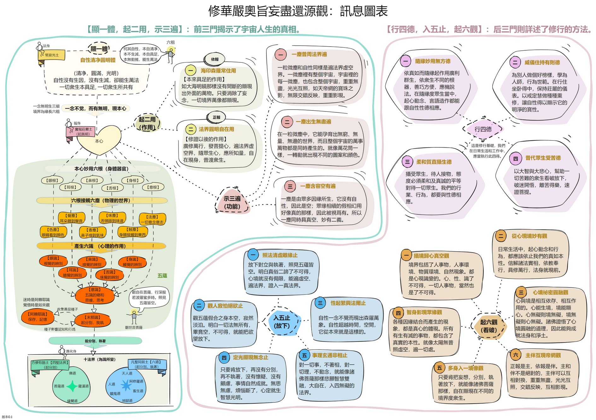

## 修華嚴奧旨妄盡還源觀
一個因緣巧合之下，我在YouTube裏接觸到體佛法師宣講唐朝賢首國師所寫的【修華嚴奧旨妄盡還源觀】。儘管法師雖然抱病，他仍然不辭勞苦地在白板上寫下重要的經文和典故，並用深入淺出的方式為我們這些聽眾解釋，我對法師深感感激和感恩。我花了兩個多月的時間看完了36集的視頻，這讓我對宇宙人生的真相和修證佛法有了明確的認識。佛經無人說，雖智不能了，沒有法師講經，我們確實是沒有辦法看懂【妄盡還源觀】。

我整理了我聽經的筆記，並參考了净空法師的【妄盡還源觀】講解，製作了一個訊息圖表，希望能幫助我們大家一起學習【妄盡還源觀】。如果有任何錯誤，請您與我[聯繫](https://github.com/csgoh/buddha-nature/issues)。

下載:【[GIF 動畫版本](images/修華嚴奧旨妄盡還源觀-圖表B3.gif)】【[PNG 版本](images/修華嚴奧旨妄盡還源觀-圖表B3.gif)】【[SketchWow 原始檔](src/修華嚴奧旨妄盡還源觀-圖表B3.sw)】